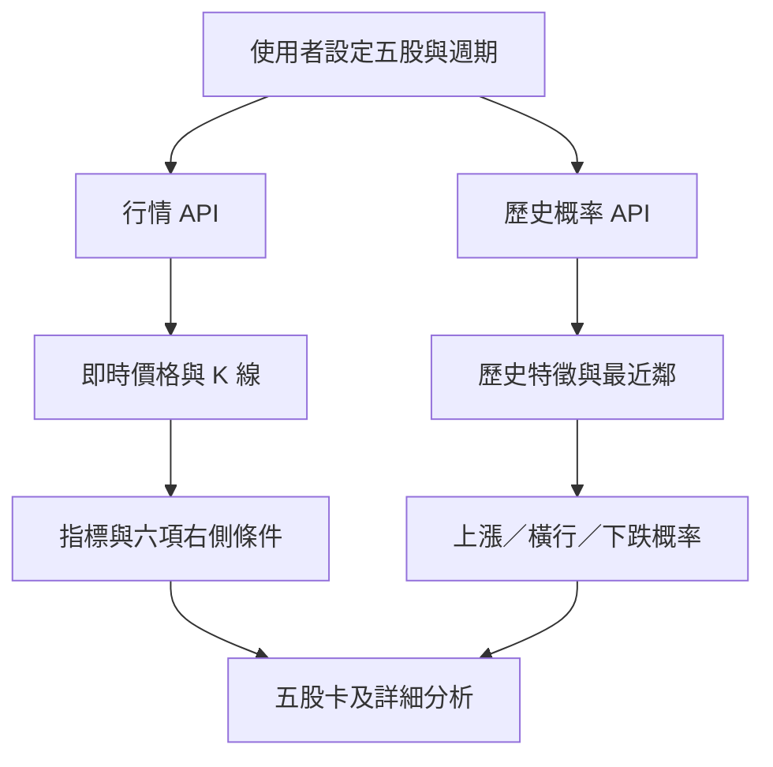

# 右側雷達：日內價量右側交易分析工具設計說明

> 版本：2.0  
> 更新日期：2026-09-18  
> 線上工具：[右側雷達](https://rightside-five-stock-radar.maple-bow-0481.chatgpt.site)

## 1. 結論

「右側雷達」是一個同時監察五隻美股的日內價量分析工具，核心目的不是預測必然升跌，而是把交易判斷拆成兩個彼此獨立的層次：

1. **右側條件分數**：目前的價格、趨勢、成交量與突破結構是否已獲確認。
2. **歷史方向概率**：同一股票過去出現相似價量形態後，上漲、橫行與下跌的歷史比例。

工具刻意不把「3/6 個條件成立」解讀成「50% 上漲概率」。規則分數回答的是「現在的結構是否完整」，概率模型回答的是「歷史上相似情況之後通常怎樣」。

---

## 2. 設計目標

### 2.1 主要目標

- 免費取得價格與成交量，不要求使用者申請 API Key。
- 同一畫面監察五隻股票。
- 支援 1 分鐘及 5 分鐘 K 線。
- 只使用完整收盤 K 線確認訊號，避免形成中的成交量造成誤判。
- 同時呈現向上與向下證據，不只尋找買入理由。
- 把假突破、放量滯漲、追價過度等風險放在主畫面。
- 顯示上漲、橫行、下跌三向概率及樣本數，避免單一方向偏誤。
- 清楚顯示失效條件，讓交易判斷可以被推翻。

### 2.2 非目標

本工具目前不處理：

- 自動下單或連接券商。
- Level 2、逐筆成交、暗池或完整訂單流。
- 新聞語意、財報事件、期權定位或宏觀事件。
- 長期基本面與估值。
- 對任何股票作出保證式升跌預測。

---

## 3. 使用流程

1. 使用者設定五個美股代號。
2. 選擇 1 分鐘或 5 分鐘圖。
3. 選擇是否在即時圖表加入盤前及盤後資料。
4. 五張監察卡顯示：
   - 最新價格與當日升跌幅；
   - 右側條件完成數；
   - 歷史上漲概率；
   - 歷史下跌概率。
5. 點選其中一隻股票後，主區域顯示：
   - K 線及成交量；
   - EMA 9、EMA 20、VWAP 與突破位；
   - 上漲、橫行、下跌概率；
   - 右側六項條件；
   - 下一步、失效條件及風險提示。

---

## 4. 資料來源與更新節奏

### 4.1 即時圖表資料

- 來源：Yahoo Finance 公開圖表端點。
- 不需要 API Key。
- 每次最多取得五隻股票。
- 即時行情每 30 秒更新一次。
- 使用者手動按下更新按鈕時立即重新取得。
- 每個股票分開處理錯誤；其中一隻失敗時，不阻止其他股票顯示。

### 4.2 概率模型資料

| 圖表週期 | 歷史範圍 | 預測時段 | 相似樣本上限 |
|---|---:|---:|---:|
| 1 分鐘 | 7 日 | 未來 15 分鐘 | 150 |
| 5 分鐘 | 60 日 | 未來 30 分鐘 | 180 |

- 概率資料每 5 分鐘重新計算一次。
- 手動更新會同時重新取得行情與概率。
- 概率模型只使用正常交易時段，避免盤前、盤後流動性差異污染比較。

### 4.3 資料限制

Yahoo Finance 公開端點屬非官方免費資料來源，可能延遲、限流、缺失或改變格式。因此：

- 畫面會標示資料延遲。
- 免費資料不可取代券商成交資訊。
- 單一股票讀取失敗時會顯示錯誤，而不是製造假行情。
- 模擬資料只可在本機開發預覽使用，正式發布環境不會以模擬資料冒充真實行情。

---

## 5. 完整 K 線原則

形成中的 K 線成交量必然低於完整週期成交量，若直接拿它與過去完整 K 線比較，會造成相對成交量失真。

因此系統按照以下方式處理：

1. 依所選週期計算 K 線理論完結時間。
2. 若目前時間仍早於最後一根 K 線的完結時間，將它標記為形成中。
3. 右側條件、成交量確認及概率特徵只使用最後一根完整 K 線。
4. 圖表仍可顯示形成中的 K 線，但不讓它觸發量能確認。

---

## 6. 技術指標

### 6.1 EMA 9 與 EMA 20

指數移動平均線公式：

```text
EMA(t) = Price(t) × α + EMA(t-1) × (1-α)
α = 2 / (Period + 1)
```

- EMA 9 代表較短期價格方向。
- EMA 20 代表較慢的日內趨勢基準。
- EMA 9 高於 EMA 20，代表短期動能相對偏強。
- EMA 9 是否高於三根 K 線前，用作短均線斜率判斷。

### 6.2 VWAP

成交量加權平均價：

```text
Typical Price = (High + Low + Close) / 3
VWAP = Σ(Typical Price × Volume) / ΣVolume
```

VWAP 在每個正常交易日重新開始累計。價格站上 VWAP，代表當日大部分成交成本之上；跌回 VWAP 下方則可能表示右側結構轉弱。

### 6.3 ATR

真實波幅：

```text
TR = max(
  High - Low,
  abs(High - Previous Close),
  abs(Low - Previous Close)
)
ATR = 最近 14 根 TR 的平均
```

ATR 用途：

- 將不同價格股票的波動標準化。
- 衡量價格距離 VWAP 是否過遠。
- 建立概率模型的橫行區間。

### 6.4 相對成交量

```text
Relative Volume = 當前完整 K 線成交量 / 前 20 根平均成交量
```

主要門檻：

- `≥ 1.15×`：成交量支持右側確認。
- `≥ 1.50×` 且價格進展很小：可能是放量滯漲。
- `< 0.75×`：突破可信度偏低。

### 6.5 收盤位置

```text
Close Location = (Close - Low) / (High - Low)
```

- 越接近 1，代表收盤越靠近該根 K 線高位。
- 右側品質條件要求陽線、收盤位置至少 65%，且實體不能過小。

---

## 7. 六項右側確認條件

| 條件 | 通過標準 | 作用 |
|---|---|---|
| 價格站上 VWAP | Close > VWAP | 確認價格高於當日成交成本中樞 |
| EMA 排列 | EMA 9 > EMA 20 | 確認短期趨勢強於中速趨勢 |
| 短均線上斜 | EMA 9 > 三根前 EMA 9 | 避免只看靜態均線交叉 |
| 成交量支持 | Relative Volume ≥ 1.15 | 確認價格行動有成交量參與 |
| 突破獲得接受 | 突破前 20 根高位，或突破後守住 | 區分越過價位與真正站穩 |
| 收盤品質 | 陽線、Close Location ≥ 0.65、實體比例 ≥ 0.30 | 排除長上影或弱收盤 |

### 7.1 狀態分類

| 狀態 | 邏輯 |
|---|---|
| 右側確認 | 至少 5/6，且突破或突破後守穩 |
| 接近確認 | 至少 4/6，但結構仍欠一項關鍵確認 |
| 等待結構 | 2–3/6 |
| 未確認 | 少於 2/6 |
| 假突破風險 | 越過關鍵位後收回其下，或前一根突破、下一根跌回 |
| 放量滯漲 | 相對量 ≥ 1.50，但實體很小且收盤位置偏弱 |
| 資料不足 | 少於 22 根完整 K 線 |

假突破與放量滯漲優先於普通分數。即使多項趨勢條件成立，只要突破沒有被接受，系統不會把它包裝成乾淨右側訊號。

---

## 8. 突破與接受

### 8.1 關鍵位

```text
Pivot = 前 20 根完整 K 線最高價
```

### 8.2 即時突破

```text
High > Pivot 且 Close > Pivot
```

只刺穿關鍵位但收盤跌回其下，不算突破獲得接受。

### 8.3 突破後守穩

若前一根已收在當時的突破位之上，而最新完整 K 線仍能收在該位置之上，視為突破獲得延續接受。

### 8.4 假突破

以下任一情況觸發假突破風險：

- 當根最高價越過 Pivot，但收盤回到 Pivot 以下。
- 前一根收盤突破，但下一根收盤跌回原突破位以下。

---

## 9. 努力與結果：放量滯漲

成交量代表投入的「努力」，價格進展代表「結果」。若成交量大幅增加，但 K 線實體很小、收盤又不靠近高位，可能表示上方供給吸收買盤。

目前定義：

```text
Relative Volume ≥ 1.50
Body Ratio < 0.25
Close Location < 0.60
```

這並不等於價格必然下跌，但代表不應只因為「放量」就判斷突破健康。

---

## 10. 歷史方向概率模型

### 10.1 模型目的

概率模型不是把規則分數換算成百分比，而是尋找同一股票過去最接近目前狀態的價量片段，再統計它們之後的實際結果。

它回答：

> 同一股票在過去出現類似趨勢、VWAP 位置、動能、成交量與突破狀態時，未來 15 或 30 分鐘分別有多少比例上漲、橫行或下跌？

### 10.2 每日重設

模型按股票交易所時區劃分交易日。以下資料每天重新開始：

- VWAP；
- 日內 EMA 狀態；
- ATR 樣本；
- 前 20 根成交量基準；
- 突破觀察窗。

這可避免隔夜跳空被錯誤當作普通日內動能。

### 10.3 特徵向量

每個可比較時間點建立以下特徵：

| 特徵 | 計算方式 | 意義 |
|---|---|---|
| VWAP 距離 | `(Close - VWAP) / ATR` | 價格相對當日成本中樞的位置 |
| EMA 差距 | `(EMA9 - EMA20) / ATR` | 短中趨勢排列強度 |
| EMA 斜率 | `(EMA9 - EMA9_3barsAgo) / ATR` | 短期趨勢加速或減速 |
| 相對成交量 | `log(max(Relative Volume, 0.1))` | 壓縮極端成交量分布 |
| 收盤位置 | `(Close - Low) / (High - Low)` | 當根買賣雙方收盤控制力 |
| 三根動能 | `(Close - Close_3barsAgo) / ATR` | 短期價格推進幅度 |
| 是否突破 | 布林值 | 目前是否收在前 20 根高位之上 |
| K 線方向 | Close ≥ Open | 陽線或陰線狀態 |

所有價格距離盡量用 ATR 標準化，使不同股價與不同波動率狀態可以比較。

### 10.4 相似度距離

數值特徵先按預設尺度標準化，再計算歐氏距離。突破狀態不同及 K 線方向不同會加入額外懲罰：

```text
Distance = sqrt(
  Σ(Standardized Feature Difference²)
  + Breakout Mismatch Penalty²
  + Candle Direction Penalty²
)
```

使用的相對尺度：

```text
VWAP Distance: 1.40
EMA Spread: 0.80
EMA Slope: 0.80
Log Relative Volume: 0.90
Close Location: 0.45
Three-bar Momentum: 1.20
Breakout Mismatch Penalty: 0.75
Candle Direction Penalty: 0.30
```

距離越小，代表歷史片段越接近目前狀態。

### 10.5 防止跨日結果污染

歷史片段只有在以下條件成立時才可成為樣本：

- 起點與結果位於同一交易日。
- 結果已經發生，不能使用尚未完成的未來資料。
- 實際經過時間介乎目標時段的 75% 至 150%，避免停牌或缺失 K 線令「六根 K 線」變成完全不同的時間長度。

### 10.6 上漲、橫行、下跌分類

每個歷史片段的橫行門檻會按當時 ATR 動態調整：

```text
Flat Threshold = clamp(0.30 × ATR / Close, 0.06%, 0.40%)
```

分類方式：

```text
Future Return > +Flat Threshold  → 上漲
Future Return < -Flat Threshold  → 下跌
其餘                            → 橫行
```

因此「橫行」不是價格完全不變，而是變動未超出當時波動率所定義的有效幅度。

### 10.7 最近鄰與權重

模型按距離排序並保留最相似樣本：

- 1 分鐘模型最多 150 個。
- 5 分鐘模型最多 180 個。

每個樣本的權重：

```text
Weight = exp(-0.8 × Distance) × (0.7 + 0.3 × Recency)
```

- 越相似，權重越高。
- 越近期，權重略高。
- 時間權重只佔 30%，避免模型完全忽略較早但高度相似的片段。

### 10.8 概率平滑

為避免少量樣本產生 0% 或 100% 的假精確結果，三個方向各加入權重為 3 的均勻先驗：

```text
Up Probability   = (Up Weight + 3) / (Total Weight + 9)
Flat Probability = (Flat Weight + 3) / (Total Weight + 9)
Down Probability = (Down Weight + 3) / (Total Weight + 9)
```

顯示前會確保三項合計為 100%。

### 10.9 預期變動

```text
Expected Move = Σ(Future Return × Weight) / ΣWeight
```

它是相似樣本的加權平均結果，不是目標價，也不代表最可能的單一路徑。

### 10.10 有效樣本數

因每個樣本權重不同，表面上的 180 個樣本不等於 180 個同等獨立樣本。有效樣本數：

```text
Effective Sample Size = (ΣWeight)² / Σ(Weight²)
```

模型品質標記為「可用」的最低條件：

- 最少 80 個最近鄰樣本；
- 有效樣本數至少 30。

若歷史可比片段少於 30 個，系統不顯示概率，而是直接回報資料不足。

---

## 11. 風險提示與失效條件

### 11.1 追價風險

若價格高於 VWAP 超過 1.5 ATR，顯示價格延伸過度，提醒等待回踩而不是追價。

### 11.2 低量突破

若相對成交量低於 0.75，提示成交量未能支持突破。

### 11.3 結構失效

基本失效邏輯：

- 收盤跌回 VWAP 下方；並且
- EMA 9 下穿 EMA 20。

若均線或 VWAP 尚未形成，則以重新跌破關鍵突破位並伴隨放量作為替代失效訊號。

---

## 12. 畫面與互動設計

### 12.1 五股監察卡

每張卡只放最需要快速掃描的資訊：

- 股票代號與市場狀態；
- 最新價格與當日升跌幅；
- 右側狀態標籤；
- 六項條件完成數與進度條；
- 上漲及下跌概率。

橫行概率放在詳細分析區，避免五張卡資訊過密。

### 12.2 主圖表

- K 線採青色上漲、玫紅色下跌。
- EMA 9、EMA 20、VWAP 採不同顏色及線型。
- 突破位使用獨立虛線。
- 成交量置於價格圖下方，並按 K 線方向著色。

### 12.3 詳細分析區

資訊順序刻意安排為：

1. 三向方向概率；
2. VWAP、突破位、相對成交量；
3. 六項右側條件；
4. 下一步；
5. 失效條件；
6. 風險提示；
7. 本次判讀所使用的完整 K 線時間。

此順序讓使用者先看到雙向結果，再閱讀支持證據與反證。

### 12.4 個人設定

以下設定保存在瀏覽器本機：

- 五股名單；
- 1 分鐘或 5 分鐘週期；
- 是否顯示盤前及盤後。

重新開啟同一瀏覽器時會恢復上次設定。

---

## 13. 系統架構



### 13.1 前端

- React／Next.js 相容架構。
- Recharts 繪製價格、指標與成交量。
- 響應式設計：桌面顯示五欄，手機可橫向滑動股票卡。
- 使用本機儲存保存偏好。

### 13.2 伺服器端

- `/api/market`：取得五股即時圖表資料。
- `/api/probability`：取得歷史資料並計算三向概率。
- 伺服器端集中連接免費行情來源，前端不直接處理供應商格式。
- 每個股票獨立回報成功或錯誤，支援部分成功結果。

---

## 14. 重要限制

### 14.1 概率不是經過保證的勝率

目前概率是「歷史相似片段的條件分布」，不是經過長期實盤驗證的交易系統勝率。它尚未包括：

- 手續費及滑價；
- 買賣差價；
- 停損與止盈規則；
- 實際入場價格；
- 隔夜風險；
- 不同市場制度的完整走勢外驗證。

### 14.2 市場狀態轉變

歷史 7 日或 60 日可能無法代表新的波動制度。例如財報、政策、重大客戶消息或市場崩跌會使過去相似形態失效。

### 14.3 新聞盲點

模型只閱讀價量，不知道 K 線背後是否發生：

- 財報或指引；
- 分析師升降級；
- 重大合約；
- 宏觀數據；
- 監管或地緣政治事件。

### 14.4 樣本依賴

最近鄰之間可能高度重疊，並非完全獨立。有效樣本數可減少假精確，但不能消除資料依賴。

### 14.5 供應商風險

免費行情端點沒有服務保證。若資料格式、限制或可用性改變，工具需要更換資料來源。

---

## 15. 正確使用方式

建議把工具當作「檢查器」，不是「下單指令器」。

### 15.1 一個合理的多頭觀察組合

- 右側條件至少 5/6；
- 突破已獲接受，而不是盤中刺穿；
- 上漲概率高於下跌概率；
- 預期變動為正；
- 價格沒有高於 VWAP 太多 ATR；
- 下一根完整 K 線仍能守住突破位。

### 15.2 一個應該等待的組合

- 條件只有 3/6；
- 上漲與下跌概率接近；
- 相對成交量不足；
- 尚未突破，或突破後立即跌回；
- 價格離 VWAP 過遠。

### 15.3 一個偏危險的組合

- 顯示假突破或放量滯漲；
- 下跌概率高於上漲概率；
- 收盤位置弱；
- 成交量很高但價格沒有相稱進展；
- 跌回 VWAP 且 EMA 9 下穿 EMA 20。

任何單一條件都不應獨立觸發交易。

---

## 16. 後續改進方向

依優先次序：

1. **走勢外驗證**：逐日滾動回測，確保計算當刻不使用未來資料。
2. **概率校準**：用 Brier Score、可靠度曲線檢查「60%」是否真的接近 60%。
3. **市場制度分類**：分開高波動、低波動、趨勢日與震盪日。
4. **時間位置特徵**：加入開市後分鐘數，避免把開市與午市直接比較。
5. **大市背景**：加入 SPY、QQQ 及行業 ETF 的相對強弱。
6. **事件過濾**：標記財報、重大宏觀數據與公司新聞時段。
7. **警報系統**：當右側確認、上下概率差距或失效條件達標時通知。
8. **交易紀錄**：保存訊號出現時的快照，供事後復盤。
9. **資料來源抽象層**：讓 Yahoo Finance 失效時可切換其他供應商。

---

## 17. 核心設計原則

1. **先確認，再行動**：右側交易不猜最低點，等待市場給出結構。
2. **價格與成交量必須互相驗證**：放量不等於利好，必須檢查價格成果。
3. **突破必須獲接受**：越過價位與站穩價位是兩件事。
4. **只用完整 K 線作確認**：避免形成中成交量造成假訊號。
5. **向上與向下同時顯示**：降低單向敘事偏誤。
6. **規則分數不是勝率**：條件完整度與歷史概率必須分開。
7. **每個判斷都要有失效條件**：沒有可被推翻的觀點，不是可管理的交易假設。
8. **承認資料限制**：免費資料與短歷史窗口不能製造確定性。

---

## 18. 免責聲明

本工具只供研究、教育及交易復盤使用，不構成投資建議、招攬或任何收益保證。市場價格可能因突發消息、流動性、交易暫停及資料延遲而大幅偏離模型。使用者應以券商資料核實價格，並自行決定倉位、最大可承受損失及是否交易。
